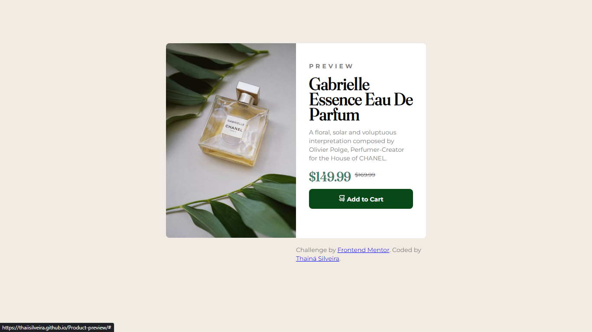

Product preview card component solution

This is a solution to the [Product preview card component challenge on Frontend Mentor](https://www.frontendmentor.io/challenges/product-preview-card-component-GO7UmttRfa).

## Table of contents

- [Overview](#overview)
  - [Screenshot](#screenshot)
  - [Links](#links)
- [My process](#my-process)
  - [Built with](#built-with)
  - [What I learned](#what-i-learned)
  - [Continued development](#continued-development)
  - [Useful resources](#useful-resources)
- [Author](#author)

## Overview

### Screenshots

### Links

- Live Site URL: https://thaiisilveira.github.io/Product-preview/

## My process

### Built with

- Semantic HTML5 markup
- CSS custom properties
- CSS Grid

### What I learned

I started to learn HTML and CSS quite recently, and since then my favorite way of studying is by creating small projects like this one, where I can practice what I've learned and stay aware of what I still need to work on. This project was a very good way to practice the grid display, since this property was a bit tricky for me at first.

### Continued development

I plan on studying more about grids, columns, and other ways of displaying content since I'm not particularly confident about it yet. There are many other CSS concepts I still need to reinforce, so I plan on doing it before moving on to Javascript (since I plan on working as a front-end developer in the future).

### Useful resources

- [W3Schools](w3schools.com) - A great go-to guide for whatever questions I might have during the coding processing.

## Author

- Linkedin - [Thainá Silveira](https://www.linkedin.com/in/thain%C3%A1-alves-silveira-77197a190)

